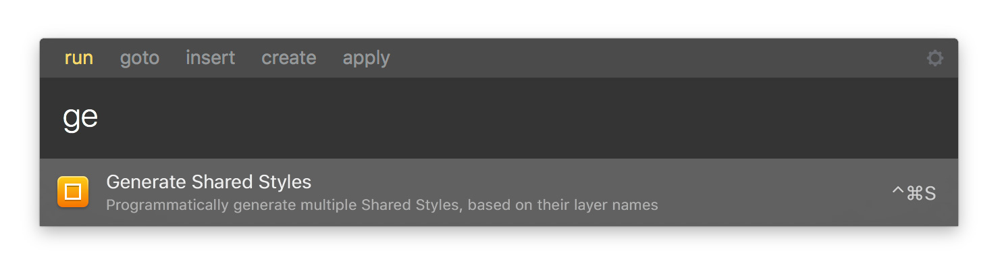

# Sketch Styles Generator

> Generate hundreds of Shared Styles in a matter of seconds

**Sketch Styles Generator** is a plugin made for [Sketch](http://sketchapp.com). It helps designers who want to generate *Shared Styles* for a *Design System*, without relying on pre-made guidelines provided by other (useful) tools like [Craft](https://www.invisionapp.com/craft).

Follow me [@lucaorio_](https://twitter.com/lucaorio_) for updates, help and other stuff! 🎉

## Contents
- [Why this Plugin?](#why-this-plugin)
- [Installation](#installation)
- [Usage](#usage)
- [FAQ](#faq)
- [Integrations](#integrations)
- [License](#license)
- [Contacts](#contacts)

## Why this Plugin?
* Sketch doesn't allow to generate **multiple Shared Styles** (text, shapes or both of them) at once ☹️
* Sketch appends a ` Style` suffix to the name of **every style** you try to create 😫
* Craft and other tools generate guidelines that may not **fit your app styling** 🤔

If you experienced at least one of the problems above, you know how painful the bootstrap of a *design system* can be. The manual creation, renaming and double-check of every Shared Style is a slow process. And time is a precious resource (aka *we got a lot of shit to do*).

**Sketch Styles Generator** allows you to select any amount of layers (text, shapes, or all of them at once), and generate multiple Shared Styles named exactly like the layer itself. Have a look at the [usage](#usage) section to know more about how to use it.


## Installation
#### Manual
* Download the repo as a zip by clicking the _Clone or download_ button
* Uncompress the `sketch-style-generator.zip` file
* Navigate to the `sketch-styles-generator/plugin/` folder
* Double-click `Sketch Styles Generator.sketchplugin` to install it

#### From the Terminal
Clone the Github repo
```
$ git clone https://github.com/lucaorio/sketch-styles-generator
```

Move to the plugin directory
```
$ cd sketch-styles-generator/plugin
```

Open the plugin to install it in [Sketch](http://sketchapp.com)
```
$ open Sketch\ Styles\ Generator.sketchplugin
```

## Usage
* **Rename** the layers you want to generate your Shared Styles from. The speed of this boring process can be *dramatically* improved by using plugins like [Find-And-Replace](https://github.com/mscodemonkey/Sketch-Find-And-Replace) and [RenameIt](https://github.com/rodi01/RenameIt).
* **Select** all of them, it doesn't matter if they are Shape or Text entities
* **Run** the plugin by clicking `Plugins->Styles Generator->Generate Shared Styles`, or by using the `ctrl`+`cmd`+`s` shortcut
* A little log on the bottom of the window will show you how many Styles were generated, and how many [were skipped](#faq).


*Sketch Styles Generator* is now fully integrated with [Sketch Runner](http://bit.ly/SketchRunnerWebsite), the ultimate tool to speed up your Sketch workflow. You can trigger the plugin by simply typing its first letters, in pure Spotlight style!



## FAQ
#### What does _Forced Overrides_ mean?
If there are multiple layers with the same name **during the generation**, just the first one will be used to create a Shared Style. Later on, if you add a layer with the same name as an already existing Shared Style, the style itself will be **overridden**, and all the related instances updated.

#### What happens if in my multiple selection there are some Symbols?
Sketch Styles Generator will detect the kind of layer you selected, and automatically skip Symbols and other entities that can't be converted into a Text/Shared Style.

## Integrations
<a href="http://bit.ly/SketchRunnerWebsite">
  
</a>

<a href="https://sketchpacks.com/lucaorio/sketch-styles-generator/install">
  
</a>

## License


***

## Contacts
* Twitter [@lucaorio](http://twitter.com/@lucaorio_)
* Website [lucaorio.com](http://lucaorio.com)
* Email [luca.o@me.com](mailto:luca.o@me.com)
