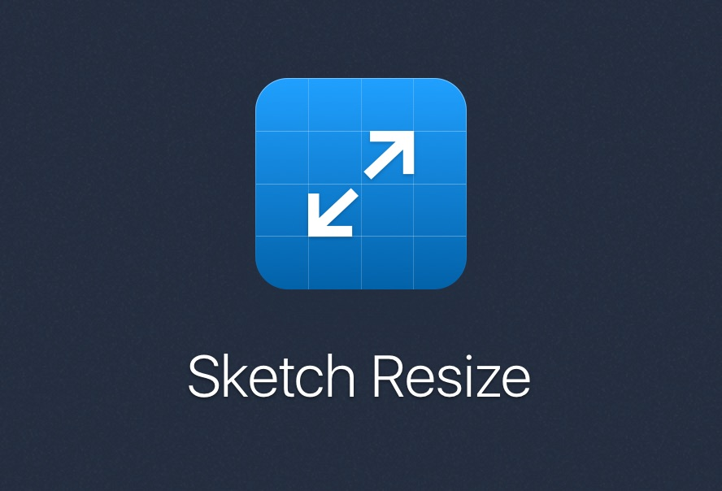
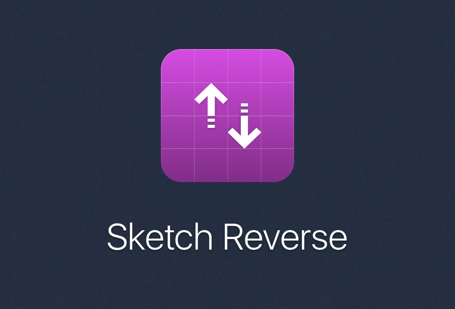

# Sketch Styles Generator

> Programmatically generate hundreds Shared Styles, all at once

**Sketch Styles Generator** is a plugin made for [Sketch](http://sketchapp.com).

You can select any amount of layers (text, shapes, or both) and generate Shared Styles for all of them, at once. The Shared Styles are named like the layers. Take a look at the [usage](#usage) section to know more about how to use it.

Follow me on Twitter [@lucaorio\_](https://twitter.com/lucaorio_) for updates, help and other stuff! 🎉

_Looking for other plugins? Give these a try!_ 😎

## Contents

- [Why this plugin?](#why-this-plugin)
- [Installation](#installation)
- [Usage](#usage)
- [FAQ](#faq)
- [Integrations](#integrations)
- [License](#license)
- [Contacts](#contacts)

## Why this plugin?

- Sketch doesn't allow to generate **multiple shared styles** at once
- Sketch appends a `Style` suffix to the name of **every style** you try to create

## Installation

#### Manual

- [Download](https://github.com/lucaorio/sketch-styles-generator/releases/latest) the latest release of the plugin [`sketch-styles-generator.zip`](https://github.com/lucaorio/sketch-styles-generator/releases/latest)
- Uncompress the downloaded file
- Double-click `Sketch Styles Generator.sketchplugin` to install

#### Via Sketch Runner

- Trigger [Sketch Runner](http://bit.ly/SketchRunnerWebsite) (`cmd+'`)
- Move to the _Install_ tab
- Search for _Styles Generator_, and install

## Usage

- **Rename** the layers you want to generate your shared styles from (you can speed up this process with [RenameIt](https://github.com/rodi01/RenameIt), or [Find-And-Replace](https://github.com/mscodemonkey/Sketch-Find-And-Replace))
- **Select** the layers (it doesn't matter if the selection includes both shapes, and text fields)
- **Run** the plugin by clicking `Plugins->Styles Generator->Generate Shared Styles`, or by using the `ctrl+cmd+s` shortcut
- A log will recap what has been generated/updated

## FAQ

#### What happens if my selection includes symbols, or artboards?

_Sketch Styles Generator_ will ignore them.

#### How to generate shared styles for grouped layers?

_Sketch Styles Generator_ doesn't recursively search for layers nested in one, or multiple groups. You can check the Sketch's native _Select Group's Content on Click_ feature and refine your selection.

#### Can I use other groups/artboards/pages to generate the names?

No. This is an intentional choice to keep the scope of the plugin as narrow as possible, simplify its maintenance, and avoid duplication of features already available in other plugins.

#### How does this plugin manage updates, and already existing styles?

Below is a quick overview of how the plugin works behind the scenes. Please note that this is a generator, _not_ a manager. 😜

`The layer has no shared style applied, and no existing shared style matches its name`: **Create a new shared style**

`The layer has no shared style applied, but there's a shared style that shares its name`: **Apply the shared style to the layer**

`The layer has a shared style applied, and its synced, but there's a mismatch between the names`: **The shared style is renamed to match the layer**

`The layer was changed, and is now out-of-sync with the shared style applied to it`: **The shared style, and all its instances are synced**

`The layer was changed in both its appereance, and name, but still connected to a shared style`: **The shared style, and all its instances are synced and renamed**

## Integrations

_Sketch Styles Generator_ is now fully integrated with [Sketch Runner](http://bit.ly/SketchRunnerWebsite), the ultimate tool to speed up your Sketch workflow. You can trigger the plugin by simply typing its name.

## License

---

## Contacts

- 🐦 Twitter [@lucaorio\_](http://twitter.com/@lucaorio_)
- 🕸 Website [lucaorio.com](http://lucaorio.com)
- 📬 Email [luca.o@me.com](mailto:luca.o@me.com)
